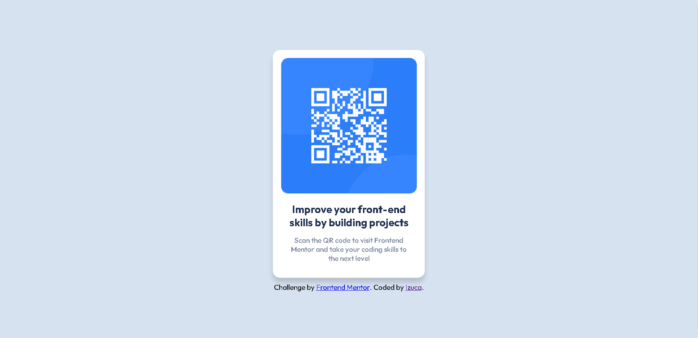

# Frontend Mentor - QR code component solution

This is a solution to the [QR code component challenge on Frontend Mentor](https://www.frontendmentor.io/challenges/qr-code-component-iux_sIO_H). Frontend Mentor challenges help you improve your coding skills by building realistic projects. 

## Table of contents

- [Frontend Mentor - QR code component solution](#frontend-mentor---qr-code-component-solution)
  - [Table of contents](#table-of-contents)
  - [Overview](#overview)
    - [The Challenge](#the-challenge)
    - [Screenshot](#screenshot)
    - [Links](#links)
  - [My process](#my-process)
    - [Built with](#built-with)
    - [What I learned](#what-i-learned)
    - [Continued development](#continued-development)


## Overview

### The Challenge
Reconstruct the design of the QR Code Component from the Frontend Mentor beginner project.
### Screenshot



### Links

- Frontend Mentor Challenge: [https://www.frontendmentor.io/challenges/qr-code-component-iux_sIO_H](https://www.frontendmentor.io/challenges/qr-code-component-iux_sIO_H)
- Live Site URL: [https://izuca.github.io/qrcode-component/](https://izuca.github.io/qrcode-component/)

## My process

### Built with

- CSS custom properties
- Flexbox

### What I learned

- I shouldn't use so much divs in my html code
- There's an easier way to centralize using flexbox:
  - First you should create a div for the flexbox container, and divs inside that will be positioned in the center
    ```html
    <div class="flexbox-container">
        <div class="container">
          
          <h1>Improve your front-end <br> skills by building projects</h1>
          <p>Scan the QR code to visit Frontend <br> Mentor and take your coding skills to <br> the next level</p>
        </div>
    ```
  - Then you can just apply the flexbox in css to centralize the contents:
    ```css
    .flexbox-container{
    display:flex;
    align-items: center;
    justify-content: center;
    flex-direction: column;
    }

    .attribution{
        text-align: center;
    }

    .container{
        align-content: center;
    }
    ```

### Continued development

After concluding this project, I noticed that I need to practice even more Flexbox in order to understand better it's concepts and applications. Also, I had a hard time trying to make the component to be vertically aligned, but after some hours researching on the internet and asking for help, I managed to make it work, although I didn't understand the solution very well:

```css
html, body, .aligner {
  height: 100%;
}
```

If you know a better way to centralize those elements or you did understand why I had to use that selectors above, please explain/show me (～￣▽￣)～


